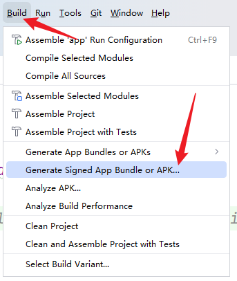
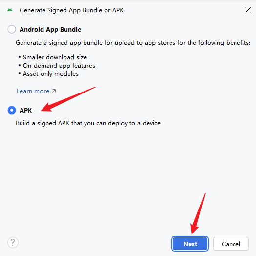
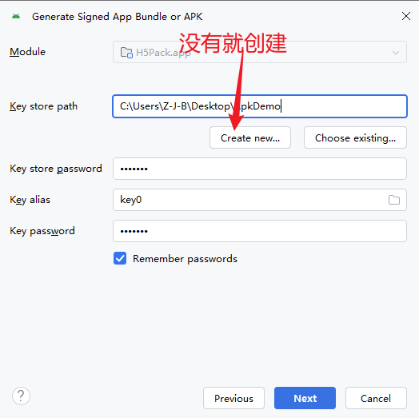
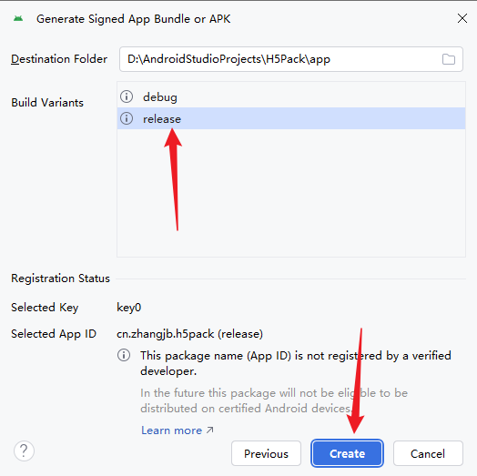
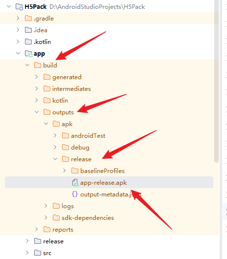
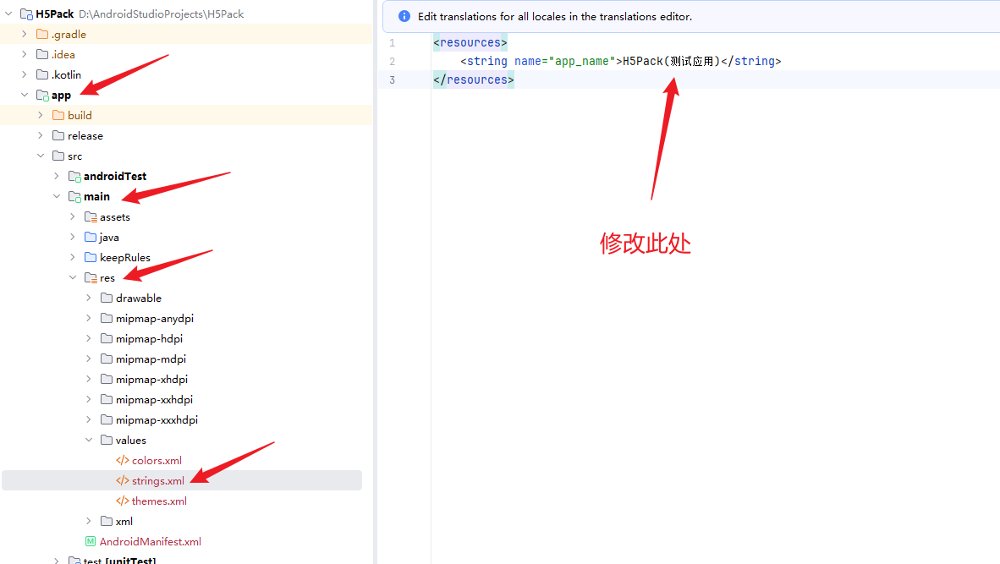
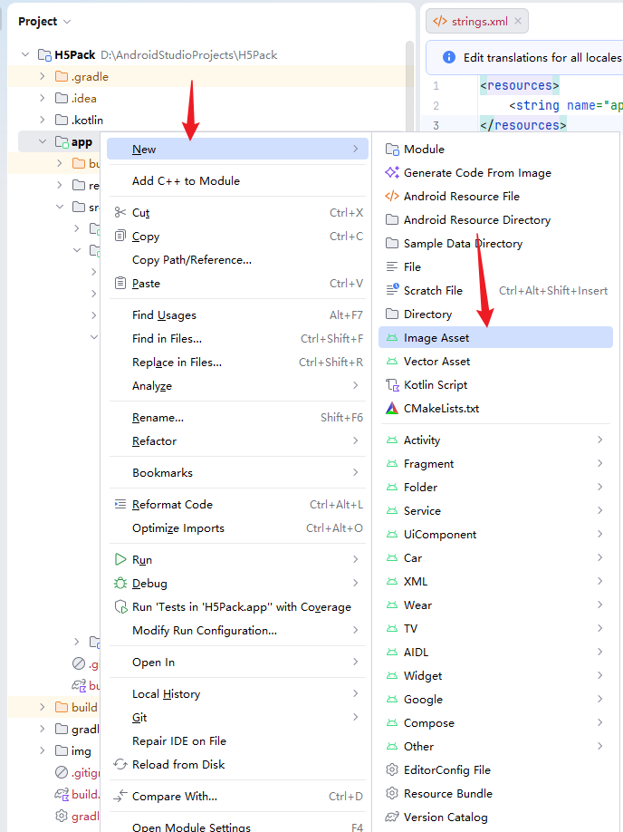
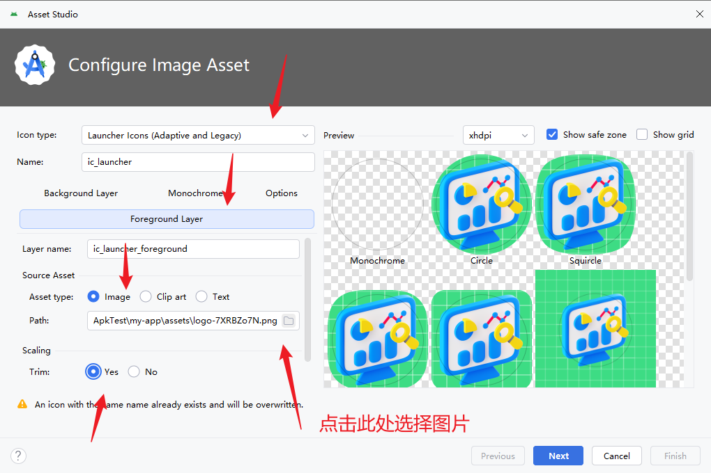
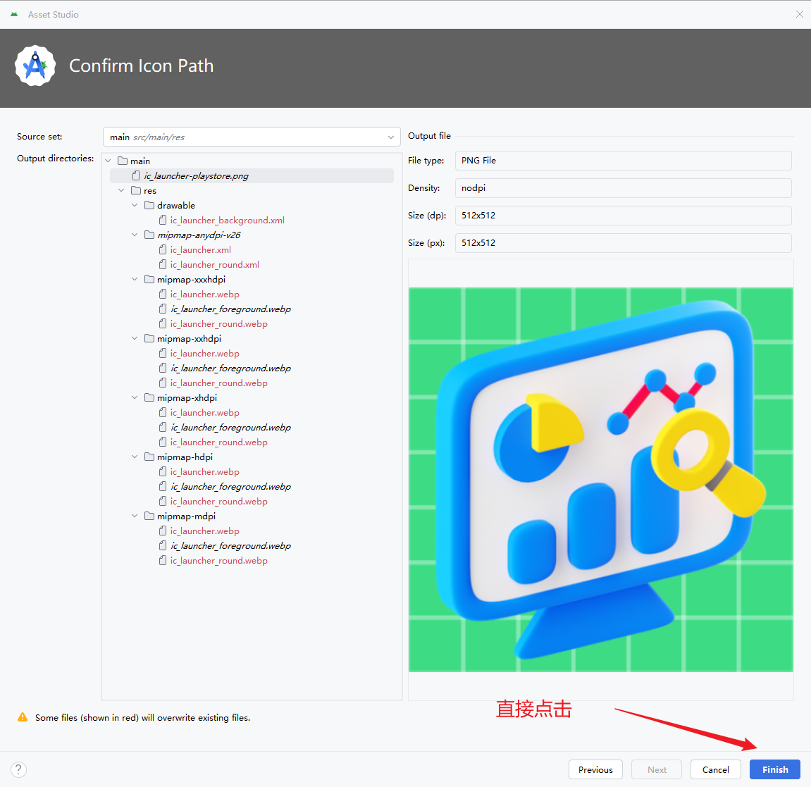
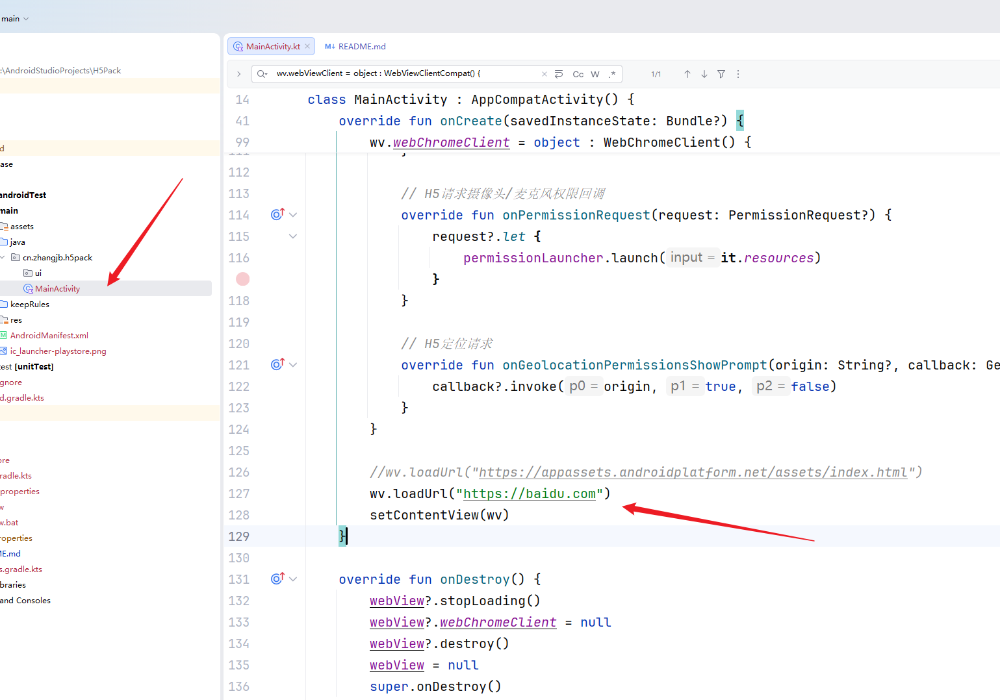

# H5ToApk
将H5转为安卓Apk
唤起App只放行了微信和支付宝,如有需要自行修改

# Android Stadio 下载地址
```agsl
https://edgedl.me.gvt1.com/android/studio/ide-zips/2026.1.4.7/android-studio-quail4-windows.zip
```

# Web打包要求(Vite为例)
- base: 必须是 `./`
- 将打包后(dist)文件夹下面的所有文件复制到 AndroidStudio的 `app/src/main/assets` 下面
  - app/sec/main/assets
    - assets
    - index.html
    


# 打包
- 点击 `build -> Generate Signed App Bundle or APK -> apk -> next -> `








# 信息修改


## 软件名称




## 软件图标








## 加载远程资源文件

```agsl
   //修改此处
   wv.loadUrl("https://baidu.com")
```

